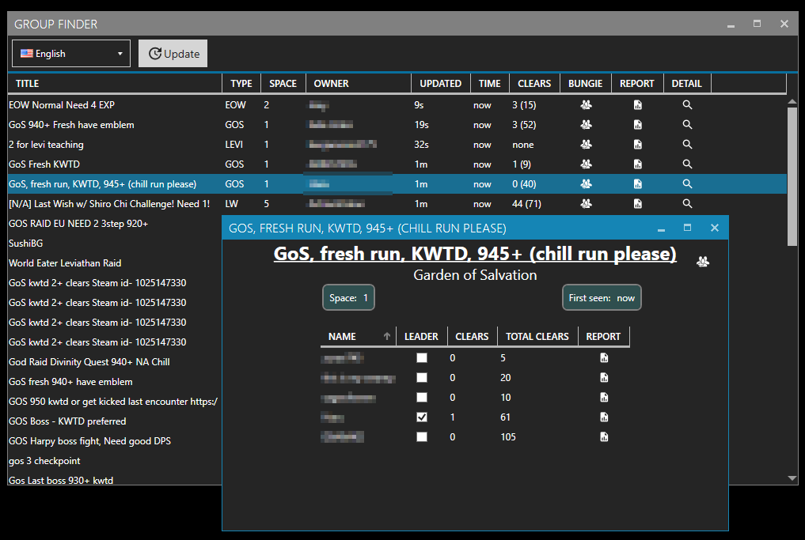

# Destiny2GroupFinder

The "Group Finder" collects data about Destiny 2 raid groups from the [bungie](https://www.bungie.net) website and combines the information with the data from [raid.report](https://raid.report) in order to display a nice overview over open raid groups.



The displayed information consists of:

- Title:  
  The title of the group on the bungie site
- Type:  
  The raid which is searched for (I try to get this from the title but typos or bossnames are not checked for)
- Space:  
  The number of open slots in this group 
- Owner:  
  The person who opened the group (bungie name)
- Updated:  
  The "updated" time according to bungie (is changed everytime someone joins/leaves the group)
- Time:  
  The time the program first saw this group
- Clears:  
  The number of clears the person has for this raid (including checkpoints) and the number of fullclears on all raids (in brackets)
- Bungie:  
  Link to the bungie group
- Report:  
  Link to the raid report of the owner of the group

Currently the program queries the bungie site every minute for updated information, by pressing the update button this can be triggered manually.  

## How to add new Raid Tags

Tags are used to match the title of the bungie raid search to a raid (as bungie does not allow to select a raid in their search for some reason ...).
A default set of tags are delivered with the application, they can be found in the installation path in the file "raidTypes.json".
To add a new tag:
1. Open the file with a text editor
2. Search for the raid where you want to add the tag (e.g. Last Wish)
3. **DO NOT** change the "BungieName", if you do: Congratulations you broke the function to show the clears per raid ;)
4. The raid you found has a list of tags like this:
```
"Tags": [
            "last wish",
            "lw",
            "riven",
            "wunsch",
            "last",
            "lastwish"
        ]
```
5. To add a new tag named "wish" edit it like this:
```
"Tags": [
            "last wish",
            "lw",
            "riven",
            "wunsch",
            "last",
            "lastwish",
            "wish"
        ]
```
6. Save and restart the application, new tags will be applied to new groups which are found; existing groups will not be updated with them
